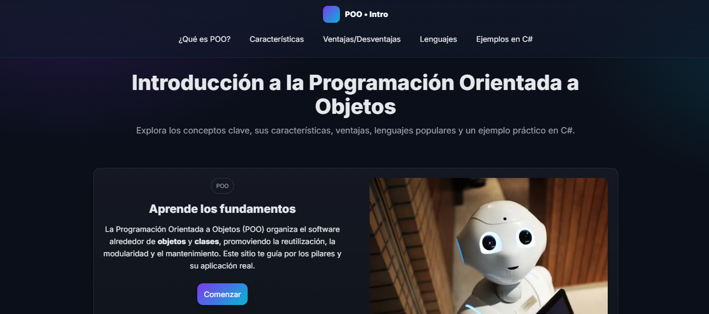

# 🧠 Project: Object-Oriented Programming (OOP)

This project is an informative web page, aimed at explaining in a clear and practical way the fundamental concepts of **Object-Oriented Programming (OOP)**.

🔗 **Live Demo:** [oop-guide.netlify.app](https://oop-guide.netlify.app)

---

## 🚀 Technologies Used
- **HTML5** → site structure  
- **CSS3** → layout and visual design  
- **JavaScript** → interactivity and DOM manipulation  

---

## 🧩 Site Content
- General explanation of **what Object-Oriented Programming (OOP) is**  
- Description of its **main characteristics**  
- Overview of the **four main pillars**: *Encapsulation, Abstraction, Inheritance, and Polymorphism*  
- Discussion of **advantages and disadvantages** of the OOP paradigm  
- Practical examples written in **C#**  
- Simple, responsive, and educational design focused on conceptual understanding  

---

## 🎯 Purpose
The goal of this project is to **reinforce the fundamentals of Object-Oriented Programming** through hands-on practice, combining theory and web development.  

---
